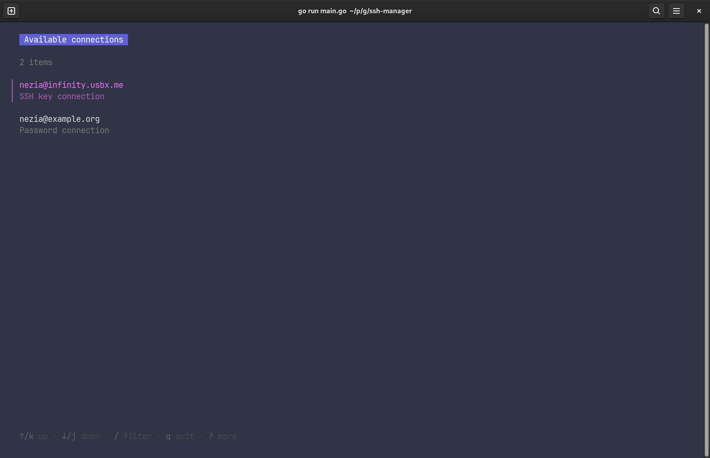

# SSH Manager


SSH Manager is a CLI application written in Go that simplifies managing multiple SSH connections. It allows for centralized management, and provides a simple way to connect to them.

## Features

- Add new SSH connections
- List all SSH connections
- Connect to a stored SSH connection
- Store passwords securely using [pass](https://www.passwordstore.org/)

## Installation

### Dependencies
- [Go](https://golang.org/)
- [pass](https://www.passwordstore.org/)

### From source

```bash
git clone https://github.com/nezia1/ssh-manager.git
cd ssh-manager
go run main.go
```
